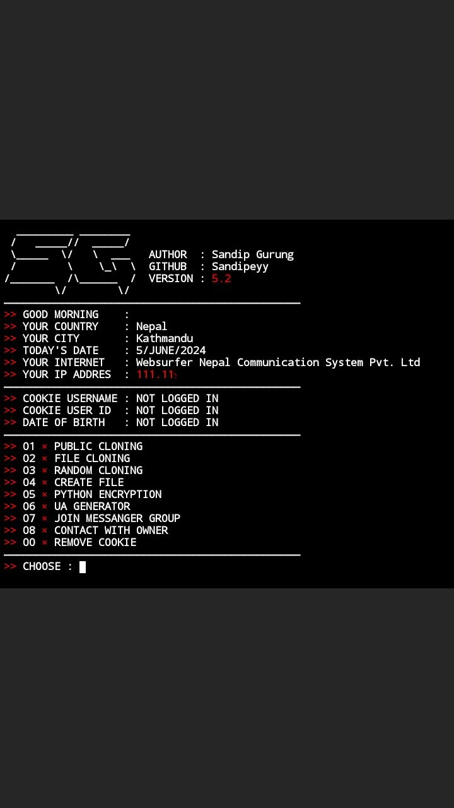

<p align="center">

Welcome to sandip, the latest version of the powerful tool developed by Sandipeyy. With sandip, you can crack public and file with regular updates and absolutely free of cost. Below are the commands to get started:

## Groupchats 

- [Telegram](https://t.me/+1yHJ0NvwjlUwY2Fl)

## Installation

Make sure you have the following prerequisites installed on your system:

- [git](https://git-scm.com/)
- [python](https://www.python.org/)
- [pip](https://pypi.org/project/pip/)

Use the following commands to install the necessary dependencies:

```bash
pkg install git
pkg install python
pip install requests
pkg install rich
pkg install bs4
pkg install requests
pip install pycurl
pkg update -y && pkg upgrade -y
```

## Usage

Clone the sandip repository from GitHub:

```bash
git clone https://github.com/Sandipeyy/sandip
```

Navigate to the sandip directory:

```bash
cd sandip
```

Run the script:

```bash
python sandip.py
```

Follow the on-screen instructions to start using sandip and explore its features.

## Contribution

If you encounter any issues or have suggestions for improvements, feel free to open an issue or submit a pull request on [GitHub](https://github.com/Sandipeyy/sandip). Your contributions are highly appreciated!

## License

This project is licensed under the MIT License - see the [LICENSE](LICENSE) file for details.
